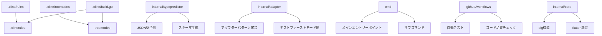

# システムパターン

## システムアーキテクチャ

このプロジェクトは、以下の主要なコンポーネントで構成されています：

1. **ルールとモード定義システム**
   - `.cline/rules`: コーディングルールを定義するマークダウンファイル
   - `.cline/roomodes`: 実装モードを定義するマークダウンファイル
   - `.cline/build.go`: ルールとモードを生成するビルドスクリプト（Goで実装済み）

2. **コアモジュール**
   - `internal/core/dig`: オブジェクトから指定したパスの値を再帰的に取得する機能（移行予定）
   - `internal/core/flatten`: JSONデータを再帰的に展開し、パス情報に変換する機能（移行予定）

3. **ユーティリティモジュール**
   - `internal/typepredictor`: JSON データから型を予測するモジュール（移行予定）
   - `internal/adapter`: テストファーストモードとアダプターパターンの実装例（移行予定）

4. **コマンドラインツール**
   - `cmd/main.go`: メインエントリーポイント（移行予定）
   - `cmd/foo.go`: サブコマンド（移行予定）
   - `cmd/bar.go`: サブコマンド（移行予定）

5. **CI/CD パイプライン**
   - `.github/workflows`: GitHub Actions による自動テストと検証

## 重要な技術的決定

1. **Goへの移行**
   - 静的型付けによる安全性
   - パフォーマンスの向上
   - 並行処理の簡素化（goroutine、channel）
   - デプロイの簡素化（単一バイナリ）
   - 標準ライブラリの充実

2. **モジュール構造の標準化**
   - `cmd/`: コマンドラインツール
   - `internal/`: 内部パッケージ
   - `pkg/`: 公開パッケージ
   - `*_test.go`: テストファイル

3. **テスト駆動開発（TDD）の採用**
   - `testing` パッケージと `testify` の使用
   - テストファーストアプローチ
   - テーブル駆動テスト
   - 高いテストカバレッジの目標設定

4. **エラー処理戦略**
   - 標準的なGoのエラー処理（`if err != nil`）
   - カスタムエラー型の定義
   - エラーラッピング（`github.com/pkg/errors`）
   - 明示的なエラーケースの定義

5. **依存関係管理**
   - Go Modules (`go.mod`, `go.sum`)
   - バージョン固定による再現性の確保
   - 依存関係の検証メカニズム（`go mod verify`, `go mod tidy`）

## 使用中の設計パターン

1. **アダプターパターン**
   - 外部 API との通信を抽象化
   - テスト時のモック化を容易にする
   - 実装の詳細を隠蔽
   - 例: `internal/adapter/adapter.go`（移行予定）

2. **ファクトリーパターン**
   - オブジェクト生成ロジックの抽象化
   - 依存性の注入を容易にする
   - 例: `NewXXX` 関数

3. **戦略パターン**
   - 異なる実装モード（スクリプト、テストファースト、モジュール）
   - インターフェースを使用した実装の切り替え
   - 例: `.roomodes` による実装モードの定義

4. **コマンドパターン**
   - CI/CD パイプラインでのコマンド実行
   - スクリプトによる自動化
   - 例: Makefileのタスク定義

5. **ビルダーパターン**
   - 複雑なオブジェクトの段階的構築
   - 例: `internal/typepredictor` での型予測とスキーマ構築（移行予定）

6. **インターフェースによる抽象化**
   - 依存性の逆転
   - テスト容易性の向上
   - 実装の詳細の隠蔽
   - 例: Goのインターフェースを使用した抽象化

## コンポーネントの関係（移行後）

## モジュール間の依存関係ルール

1. **モジュール間の参照ルール**
   - 上位レベル（アプリケーション）から下位レベル（ユーティリティ）への依存方向
   - 内部パッケージ（`internal/`）は外部からアクセス不可
   - 公開パッケージ（`pkg/`）は外部からアクセス可能
   - インターフェースは使用側のパッケージで定義

2. **依存関係の検証メカニズム**
   - `go mod verify`: 依存関係の整合性チェック
   - `go mod tidy`: 未使用の依存関係の削除
   - `go vet`: 潜在的な問題のチェック
   - `golangci-lint`: 複数のリンターを統合

3. **循環参照の防止**
   - 明確な依存方向の設定
   - 共通機能の抽出と再利用
   - インターフェースによる抽象化
   - 依存性逆転の原則の適用

## アーキテクチャ上の制約

1. **パフォーマンス制約**
   - 大規模な JSON データ処理時のメモリ使用量
   - 循環参照の検出と処理
   - 並行処理の適切な使用

2. **セキュリティ制約**
   - 入力検証の徹底
   - 外部依存の最小化
   - 適切なエラー処理

3. **拡張性の考慮**
   - 新しい実装モードの追加容易性
   - 新しいデザインパターンの例の追加
   - モジュール構造の柔軟性

4. **移行に関する制約**
   - TypeScriptとGoの型システムの違い
   - 非同期処理モデルの違い（Promise vs goroutine/channel）
   - テスト方法の違い
   - 依存関係管理の違い

## 移行戦略

1. **段階的な移行**
   - 各モジュールを個別に移行
   - 一度に全てを移行しない
   - 各モジュールの移行後にテストを実行

2. **優先順位**
   - コア機能（core/）を最初に移行
   - 次にコマンドラインツール（cmd/）を移行
   - その後、他のモジュールを移行

3. **テストファーストアプローチ**
   - 各モジュールの移行前にGoでテストを作成
   - テストに基づいて実装を行う
   - 既存のTypeScriptのテストケースを参考にする

4. **アダプターパターンの活用**
   - 外部依存を抽象化するためにアダプターパターンを使用
   - テスト時のモック化を容易にする
   - 移行中の互換性を確保