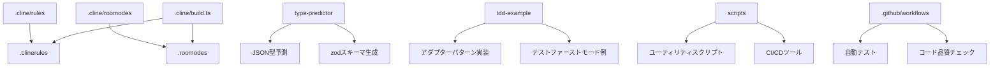

# システムパターン

## システムアーキテクチャ

このプロジェクトは、以下の主要なコンポーネントで構成されています：

1. **ルールとモード定義システム**
   - `.cline/rules`: コーディングルールを定義するマークダウンファイル
   - `.cline/roomodes`: 実装モードを定義するマークダウンファイル
   - `.cline/build.ts`: ルールとモードを生成するビルドスクリプト

2. **ユーティリティモジュール**
   - `type-predictor`: JSON データから型を予測するモジュール
   - `tdd-example`: テストファーストモードとアダプターパターンの実装例

3. **スクリプトとツール**
   - `scripts`: 単一ファイルのスクリプトとユーティリティ
   - `cmd`: コマンドラインツール

4. **CI/CD パイプライン**
   - `.github/workflows`: GitHub Actions による自動テストと検証

## 重要な技術的決定

1. **Deno の採用**
   - TypeScript のネイティブサポート
   - 組み込みのセキュリティ機能
   - 依存関係の明示的な管理
   - 標準ライブラリの充実

2. **モジュール構造の標準化**
   - `mod.ts`: モジュールのエントリーポイント
   - `deps.ts`: 依存関係の一元管理
   - `types.ts`: 型定義
   - `*.test.ts`: テストファイル

3. **テスト駆動開発（TDD）の採用**
   - `@std/expect` と `@std/testing/bdd` の使用
   - テストファーストアプローチ
   - 高いテストカバレッジの目標設定

4. **エラー処理戦略**
   - `neverthrow` による Result 型の使用
   - 型安全なエラーハンドリング
   - 明示的なエラーケースの定義

5. **依存関係管理**
   - `jsr:` と `npm:` の優先使用
   - バージョン固定による再現性の確保
   - 依存関係の検証メカニズム

## 使用中の設計パターン

1. **アダプターパターン**
   - 外部 API との通信を抽象化
   - テスト時のモック化を容易にする
   - 実装の詳細を隠蔽
   - 例: `tdd-example/adapter-pattern.ts`

2. **ファクトリーパターン**
   - オブジェクト生成ロジックの抽象化
   - 依存性の注入を容易にする
   - 例: `createFetcher` 関数

3. **戦略パターン**
   - 異なる実装モード（スクリプト、テストファースト、モジュール）
   - 実行時に戦略を切り替え可能
   - 例: `.roomodes` による実装モードの定義

4. **コマンドパターン**
   - CI/CD パイプラインでのコマンド実行
   - スクリプトによる自動化
   - 例: `scripts/check-ci.ts`, `scripts/git-push-with-ci.ts`

5. **ビルダーパターン**
   - 複雑なオブジェクトの段階的構築
   - 例: `type-predictor` での型予測とスキーマ構築

## コンポーネントの関係

## モジュール間の依存関係ルール

1. **モジュール間の参照ルール**
   - モジュール間の参照は必ず `mod.ts` を経由する
   - 他のモジュールのファイルを直接参照してはいけない
   - 同一モジュール内のファイルは相対パスで参照する
   - モジュール内の実装は `deps.ts` からの re-export を参照する

2. **依存関係の検証メカニズム**
   - コマンドラインでの検証: `deno task check:deps`
   - リントプラグインによる検証: `deno lint`

3. **循環参照の防止**
   - 明確な依存方向の設定
   - 共通機能の抽出と再利用
   - インターフェースによる抽象化

## アーキテクチャ上の制約

1. **パフォーマンス制約**
   - 大規模な JSON データ処理時のメモリ使用量
   - 循環参照の検出と処理

2. **セキュリティ制約**
   - Deno のパーミッションモデルの遵守
   - 外部依存の最小化

3. **拡張性の考慮**
   - 新しい実装モードの追加容易性
   - 新しいデザインパターンの例の追加